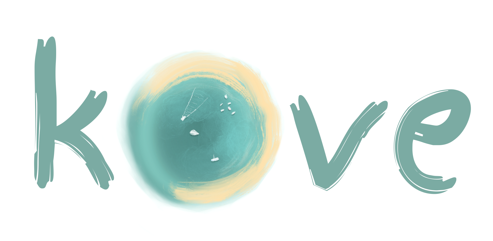
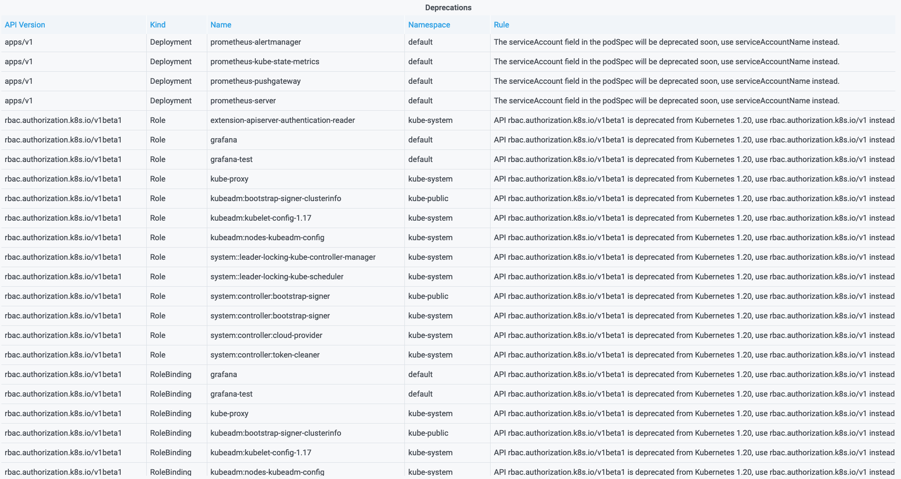

<p align="center">
  
</p>
<p align="center">
  <a href="https://github.com/cmacrae/kove/blob/master/LICENSE">
    
  </a>
  <a href="https://github.com/cmacrae/kove/compare/v0.2.0...HEAD">
    
  </a>
  <a href="https://github.com/cmacrae/kove/projects/1">
    
  </a>
  <a href="https://goreportcard.com/report/github.com/cmacrae/kove">
    
  </a>
</p>
<p align="center">
  <a href="https://github.com/users/cmacrae/packages/container/package/kove">
    
  </a>
  <a href="https://hub.docker.com/r/cmacrae/kove">
    
  </a>
  <a href="https://opencontainers.org/">
    
  </a>
  <a href="https://artifacthub.io/packages/helm/cmacrae/kove">
    
  </a>
  <a href="https://snyk.io">
    
  </a>
</p>

#
Watch your in cluster Kubernetes manifests for OPA policy violations and export them as Prometheus metrics.  
Craft alerts & dashboards based on the structured data of the objects live in your environment(s).

## About
[Open Policy Agent](https://www.openpolicyagent.org/) provide the fearsome-but-trustworthy  [gatekeeper](https://github.com/open-policy-agent/gatekeeper), which
allows for [admission control](https://www.openpolicyagent.org/docs/latest/kubernetes-introduction/#how-does-it-work-with-plain-opa-and-kube-mgmt) of Kubernetes
manifests being submitted to the API. This is really nice and allows administrators to control the manifests coming in as fine-grained as they please.  

However, administrators may not always want to take direct action (such as denial) on manifests arriving at the API. This is where kove comes in.  
It allows administrators of Kubernetes clusters to define [Rego](https://www.openpolicyagent.org/docs/latest/policy-language/) policies that they want to flag violations for by exposing a [Prometheus](https://prometheus.io/) metric.  

Some example use cases include monitoring the use of deprecated APIs, unwanted docker images, or container vars containing strings like `API_KEY`, etc.  
Administrators can craft dashboards or alerts when such conditions are observed to better expose this information to users.

kove is built on an [informer](https://pkg.go.dev/k8s.io/client-go/informers) model, rather than admission control - so, it works on any existing objects in your cluster, instead of evaluating them when they arrive at the API (upon create/update). This means it'll expose policy violators that may otherwise go unnoticed if they're not updated often.

## Example Implementations
### kove-deprecations
A good example built on top of kove is the [kove-deprecations Helm Chart](https://artifacthub.io/packages/helm/cmacrae/kove-deprecations).  
It provides metrics for objects using APIs, annotations, and other such properties which are considered (or, soon to be) deprecated.

Simple alerts or Grafana dashboards can then be built for an overview:


This grants administrators automated visibility over the objects in their cluster that meet such criteria, which in turn allows for easier preparation of cluster upgrades and alignment with best practices.

Take a look at [the `policies/` directory](https://github.com/cmacrae/helm-charts/tree/master/charts/kove-deprecations/policies) (heavily based on the policies from [swade1987/deprek8ion](https://github.com/swade1987/deprek8ion)).

## Metrics
| Metric                                 | Description                                                                                                                                                     |
|:---------------------------------------|:----------------------------------------------------------------------------------------------------------------------------------------------------------------|
| `opa_policy_violation`                 | Represents a Kubernetes object that violates the provided Rego expression. Includes the labels `name`, `namespace`, `kind`, `api_version`, `ruleset` and `data` |
| `opa_policy_violations_total`          | Total number of policy violations observed                                                                                                                      |
| `opa_policy_violations_resolved_total` | Total number of policy violation resolutions observed                                                                                                           |
| `opa_object_evaluations_total`         | Total number object evaluations conducted                                                                                                                       |

## Usage
`ConfigMap` objects containing the Rego policy/policies and the application configuration can be mounted to configure what you want to evaluate and how you want to evaluate it.

### Options
| Option   | Default | Description                                                                                             |
|:---------|:--------|:--------------------------------------------------------------------------------------------------------|
| `config` | `""`    | Path to the config file. If not set, this will look for the file `config.yaml` in the current directory |

#### `config`
A YAML manifest can be provided in the following format to describe how and what you want to watch for evaluation:
```yaml
namespace: default
ignoreChildren: true
regoQuery: data.pkgname.blah
policies:
  - example/policies
objects:
  - group: apps
    version: v1
    resource: deployments
  - group: apps
    version: v1
    resource: daemonsets
  - group: apps
    version: v1
    resource: replicasets
```

| Option           | Default        | Description                                                                                                                                          |
|:-----------------|:---------------|:-----------------------------------------------------------------------------------------------------------------------------------------------------|
| `namespace`      | `""`           | Kubernetes namespace to watch objects in. If empty or omitted, all namespaces will be observed                                                       |
| `ignoreChildren` | `false`        | Boolean that decides if objects spawned as part of a user managed object (such as a ReplicaSet from a user managed Deployment) should be evaluated   |
| `regoQuery`      | `data[_].main` | The Rego query to read evaluation results from. This should match the expression in your policy that surfaces violation data                         |
| `policies`       | none           | A list of files/directories containing Rego policies to evaluate objects against                                                                     |
| `objects`        | none           | A list of [GroupVersionResource](https://pkg.go.dev/k8s.io/apimachinery/pkg/runtime/schema#GroupVersionResource) expressions to observe and evaluate. If empty **all** object kinds will be evaluated (apart from those defined in `ignoreKinds`) |
| `ignoreKinds`    | `[`<br>`apiservice`<br>`endpoint`<br>`endpoints`<br>`endpointslice`<br>`event`<br>`flowschema`<br>`lease`<br>`limitrange`<br>`namespace`<br>`prioritylevelconfiguration`<br>`replicationcontroller`<br>`runtimeclass`<br>`]` | A list of object kinds to ignore for evaluation |
| `ignoreDifferingPaths` | `[`<br>`metadata/resourceVersion`<br>`metadata/managedFields/0/time`<br>`status/observedGeneration`<br>`]` | A list of JSON paths to ignore for reevaluation when a change in the monitored object is observed |

The above example configuration would instruct kove to monitor `apps/v1/Deployment`, `apps/v1/DaemonSet`, and `apps/v1/ReplicaSet` objects in the `default` namespace, but ignore child objects, yielding its results from the `data.pkgname.blah` expression in the provided policy.  

#### `policies`
There are some important semantics to understand when crafting your Rego policies for use with kove.  
The expression that you evaluate from your query must return structured data with the following fields:  
- `Name`: The name of the object being evaluated
- `Namespace`: The namespace in which the object you're evaluating resides
- `Kind`: The kind of object being evaluated
- `ApiVersion`: The version of the Kubernetes API the object is using
- `RuleSet`: A short description that describes why this is a violation
- `Data`: Additional arbitrary data you wish to expose about the object

The above data are provided by kove when it evaluates an object, with the exception of `RuleSet` & `Data` which should be defined in the Rego expression.
For instance, if we were to evaluate the query `data.example.bad`, our policy may look something like [this](example/policies/bad-stuff.rego):

```rego
package example

# Label matchers we want to look for.
labels["secure"] = ["nope"]

# Kinds of objects we care about evaluating.
# This isn't strictly necessary if you're satisfied with the 'objects' configuration
# option for kove; it'll only watch what it's told.
kinds = ["Deployment", "StatefulSet", "DaemonSet"]

bad[stuff] {
	# Assign our object manifest (input) to the variable 'r'
	r := input

	# Does our object's 'kind' field match any in our 'kinds' array?
	r.kind == kinds[_]

	# Does our object's 'secure' label match any in our 'labels.secure' array?
	r.metadata.labels.secure == labels.secure[_]

	# If the above conditions are true, express a set containing various pieces of
	# information about our object. As you can see, we're assigning this to the variable
	# 'stuff', which you may notice in the expression signature is what we're returning.
	# This information is then used to expose a Prometheus metric with labels using this
	# information.
	stuff := {
		"Name": r.metadata.name,
		"Namespace": r.metadata.namespace,
		"Kind": r.kind,
		"ApiVersion": r.apiVersion,
		"RuleSet": "Insecure object", # Explain why this is a violation
		"Data": r.metadata.annotations["something"] # Additional arbitrary information
	}
}
```

If you have a test cluster (perhaps built on [kind](https://kind.sigs.k8s.io/)), you can try out the evaluation of [this policy](example/policies/bad-stuff.rego) against [a violating Deployment](example/violating-manifests/bad-stuff-deployment.yaml).  
Check out more [`examples/`](examples).

## Deployment [](https://artifacthub.io/packages/search?page=1&repo=cmacrae&ts_query_web=kove)
A Helm Chart is available on [Artifact HUB](https://artifacthub.io/packages/helm/cmacrae/kove) with accompanying implementation charts built on top of it, like [kove-deprecations](https://artifacthub.io/packages/helm/cmacrae/kove-deprecations)
